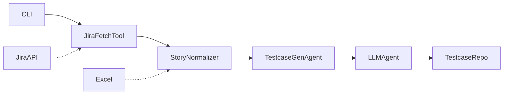

# Automation Framework Architecture

## Major Modules & Responsibilities

### 1. **AI Agents (`ai/agents/`)
- **Orchestration Agent:** Central entry point for user requests. Handles intent parsing, environment health check, prompt building, job creation, and queueing via Redis.
- **Other Agents:** Specialized for coding, searching, and test case generation.

### 2. **AI Client & Providers (`ai/ai_client.py`, `ai/providers/`)
- Abstracts LLM providers (OpenAI, Anthropic, Ollama) for prompt completion and tool use.

### 3. **Story Normalization (`ai/utils/story_normalizer.py`)
- Normalizes user stories from Excel/Jira to a canonical format for prompt building.

### 4. **Testcase Generation Service (`services/testcase_generation_service.py`)
- Core workflow for generating and validating test cases from requirements.
- Uses repository pattern for persistence.

### 5. **Repositories (`repositories/`)
- **CsvRepository:** Writes test cases to CSV/Excel using templates and field mapping.
- Other repositories for different storage backends.

### 6. **MCP (Multi-Channel Platform) (`mcp/`)
- Integrations for Excel, Jira, and tool schemas.
- Registry and client abstractions for external systems.

### 7. **Configuration (`config/`)
- Centralized config, logging, and environment management.
- LLM and external service credentials.

### 8. **Scripts (`scripts/`)
- **orchestrate_test_generation.py:** CLI for end-to-end test generation (reads stories, normalizes, generates test cases, writes output).
- **environment_healthcheck.sh:** Ensures required services (e.g., Redis, LLMs) are running.
- Utility scripts for starting/stopping services and validation.

### 9. **Tests (`tests/`)
- Unit, integration, and fixture-based tests for all major modules.

---

## Component Interaction & Orchestration Flow

### High-Level Flow

1. **User/CLI** triggers test generation (via script or agent).
2. **Orchestration Agent** parses intent, runs environment health check, builds prompt, and enqueues job in Redis.
3. **Story Normalizer** standardizes user stories from Excel/Jira.
4. **Testcase Generation Service** generates test cases using LLMs and saves them via repository.
5. **Repositories** persist results to CSV/Excel.
6. **MCP** handles integration with external systems (Jira, Excel).
7. **Health Check** ensures all dependencies are available before execution.

---

## Mermaid Diagram

```mermaid
flowchart TD
    subgraph User Interaction
        CLI[CLI / User Request]
    end

    subgraph Orchestration
        OA[Orchestration Agent]
        HealthCheck[Environment Health Check]
        Intent[Intent Router]
        Prompt[Prompt Builder]
        Queue[Redis Queue Manager]
    end

    subgraph Test Generation Pipeline
        StoryNorm[Story Normalizer]
        TCGService[Testcase Generation Service]
        Repo[CsvRepository / Output Repository]
    end

    subgraph Integrations
        Jira[Jira MCP/Client]
        Excel[Excel MCP/Client]
        LLM[LLM Providers (OpenAI, Anthropic, Ollama)]
    end

    CLI --> OA
    OA --> HealthCheck
    OA --> Intent
    Intent --> Prompt
    Prompt --> Queue
    Queue -->|Job| StoryNorm
    StoryNorm --> TCGService
    TCGService --> LLM
    TCGService --> Repo
    StoryNorm --> Jira
    StoryNorm --> Excel
    Repo --> Excel

    HealthCheck -.->|Checks| LLM
    HealthCheck -.->|Checks| Redis[(Redis)]
    OA -->|Status| Queue
```

---

## Notes for Contributors

- **Add new LLMs** via `ai/providers/`.
- **Extend orchestration** in `ai/agents/orchestration_agent.py`.
- **Add new integrations** in `mcp/`.
- **Test everything** under `tests/`.
